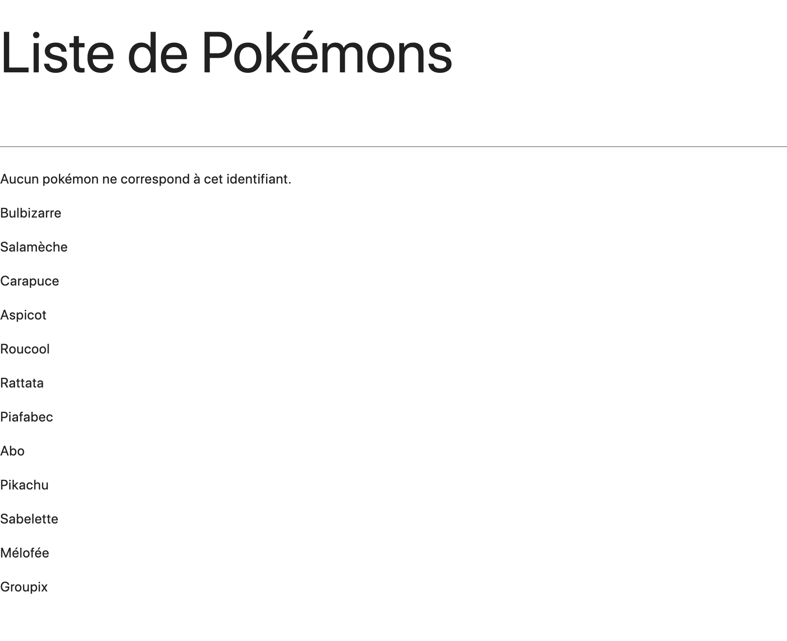
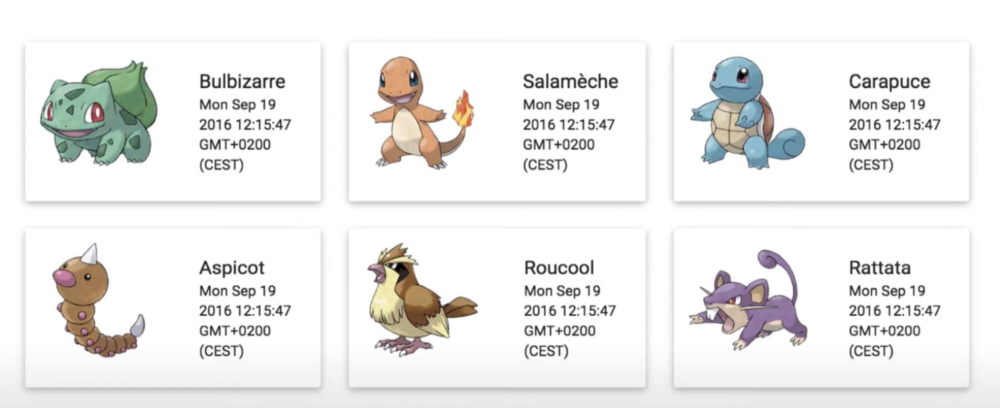

# TRANSCENDENCE - ANGULAR

## ANGULAR


This document focus on Angular , a typescript frontend framework 

https://angular.io/


#### USAGE

installer nodejs LTS (last stable version) qui installer aussi npm (gestionnaire de paquets javascript)

installer Angular CLI : npm install -g @angular/cli

ng new ng-pokemon-app --minimal --style=css 

-> cette commande va générer un nouveau (socle du) projet (new), appelée ng-pokemon-app, --minimal pour générer une version allégée du socle
du projet, --style pour préciser qu'on veut du code css pour le style de l'application

angular ensuite propose d'ajouter les routes pour le projet (utile car on va avoir plusieurs pages)
angular cli crée les fichiers de base puis installe ensuite les packages nécéssaires

#### INFO sur ce qui est installer

dossier générer 		: node_modules, il contient toutes les dépendances du projet (dont angular)
						: src : sources du projet
							> app : code source
								> app-routing.module.ts : fichier contenant les routes
								> app.component.ts : fichier composant racine
								> app.module.ts : fichier module racine
							> assets : assets du projet (images par exemple)
							> environments : variable d'environnement du projet
								> environment.ts : fichier de configuration pour chacun des environements de destination
								> environment.prod.ts : variables globales pour l'environnement de production
							-- fichier de configurations --
							> .browserslistrc : utilisé par angular cli pour parametré des outils en fonction du navigateur
							> .gitignore : fichier a ignorer pour git
							> angular.json : contient la configuration d'angular cli
							> package.json : description des dépendances du projet
							> package-lock.json : permet de figer des dépendances du projet de maniere plus précise
							> README.md : pour écrire la description du projet
							> tsconfig.app.json : contient la configuration du compilateur typescript pour ce projet angular
							> tsconfig.json : contient la configuration principale du compilateur typescript pour ce projet angular


On commence avec le fichier composant de base "app.component.ts", on le clean pour ne garder que le titre `<h1>`.
il est en 3 parties, import, @Component et export class AppComponent :
	> import { Component } from '@angular/core' sert à importer les éléments nécéssaires au fichier
	on importe ici l'élément "Component" de la librairie angular/core (le coeur du framework angular)
	> on utilise cette importation Component sous la forme du décorateur @Component qui va nous permettre de construire un composant
	web avec angular, au minimum un composant nécéssite 2 options, 'selector' qui permet de le nommner pour l'identifier ensuite c'est une balise <'selector'> qui sera alors insérer dans le code html (meme si elle n'existe pas de base),
	'template' définit le code html associé à ce compostant web, il existe aussi templateUrl qui permet de décrirer le template dans un fichier apart, le template est décrit entre backtick '`' afin de pouvoir écrire des strings sur plusieurs lignes (Javascript ES6)
	{{title}} double '{}' permet d'afficher la valeur title du composant
	> export class AppComponent, ici on décrit les propriétés pour notre composant appelé AppComponent
	on délcare un proprieté 'title' par example et angular saura pousser sa valeur entre {{}}
	export permet d'exporter notre composant pour le rendre disponible ailleurs dans l'application (avec import)

fichier app.module.ts :
	> les modules servent a regrouper des composants en fonction de leurs fonctionnalités
	> on importe différents module dedans
	> BrowserModule fournis les éléments essentiels au bon fonctionnement du module (directives ngif et ngfor p.ex)
	> NgModule similaire a Component, sert a déclarer des modules
	> dans @NgModule on retrouve :
		> declarations: qui contient une liste de tous les composants appartenant a ce module
		> imports : qui contient une liste de tous les modules qu'on a besoin d'importer dans notre module
		> providers: qui permet d'utiliser le systeme d'injection d'angular (il en existe d'autre maniere)
		> bootstrap: propre au module racine, permet de définir le premier composant a demarer lorsqu'on lance l'application

on ajoute apres la ligne 'strict' dans le tsconfig.json '"strictPropertyInitialization": false,'
afin de ne pas devoir typé les variables venant du serveur
(celle qui ne sont pas directement initialisé a undefined), ex : title: string; au lieu de title: <string|undefined>;

#### Les Composants

app.component.ts

un composant est un systeme completement encapsulé qui controle une portion de l'écran, cette portion est appelée la vue
cette vue est définie dans le template du composant, la logique de cette vue est pilotée depuis la classe du composant
un composant Web est donc une classe + une vue, la logique du composant étant définie dans sa classe (tout ce qu'il faut pour faire fonctionner la vue) et dans le template on retrouve la vue en elle meme, celle qui est rendue a l'utilisateur

chaque composant a un cycle de vie, gérer directement par Angular, on peut agir sur ces moments de vie grâce aux interfaces suivantes :

	> ngOnChanges :
		C'est la méthode appelée em premier lors de la création du'un composant, avant même ngOnInit, et à chaque fois que Angular détecte que les valeurs d'une propriété du composant sont modifiées.
		La méthode reçoit en paramètre un objet représentant les valeurs actuelles et les valeurs précédentes disponibles pour ce composant.
	
	> ngOnInit :
		Cette méthode est appelée juste après le premier appel à ngOnChanges, elle initialise le composant après que Angular ait initialisé les propriétés du composant.
	
	> ngDoCheck :
		On peut implémenter cette interface pour étandre le comportement par défaut de la méthode ngOnChanges, afin de pouvoir détecter et agir sur des changements que Angular ne peut pas détecter par lui même.
	
	> ngAfterViewInit :
		cette méthode est appelée juste après la mise en place de la vue d'un composant (et des vues de ses composants fils s'il en a).

	> ngOnDestroy :
		Appelée en dernier, cette méthode est appelée avant qu'Angular ne détruise et ne retire du DOM le composant.
		Cela peut se produire lorsqu'un utilisateur navigue d'un composant à un autre par exemple.
		Afin d'éviter les fuites de mémoire, c'est dans cette méthode que nous effectuerons un certain nombre d'opérations afin de laisser l'application "propre" (nous détacherons les gestionnaires d'évènements par exemple).

- initialisation du composant :
il faut importer les interfaces que l'on veut utiliser (ex : import { Component, OnInit } from '@angular/core';)
puis l'implémenter dans le composant (ex : export class AppComponent implements OnInit) et enfin, 
définir la méthode associé à cette interface : ngOnInit() : void {} dans la classe

- gerer interactions utilisateur sur le composant :
capture de l'interaction se fait coté template car c'est un évenement
lorsqu'un utilisateur déclenche un évènement est déclenchée côté classe

exemple d'évènement :

	  selectPokemon(pokemonName: string) {
	  	console.log(`vous avez cliqué sur le pokémon ${pokemonName}`);
	  }

	la fonction prend en parametre une vaiable string
	grâce aux backticks `` on peut écrire des variables directement dans les chaines de caracteres comme suit : `${varName}` (JS ES6)
	on peut éviter les concaténations


#### Les Templates

- Ce sont les vues de nos composants, ils contiennent le code de l'interface utilisateur
- Grâce à la propriété templateUrl de Angular, on peut décrire le template dans un fichier séparé
on nomme idéalement ce fichier "app.component.html" soit, le même nom que le composant mais avec une extension .html au lieu de .ts
- Interpolation : permet de dire a Angular d'afficher nos propriétés coté classe du composant dans le template du composant pour ce faire
on utilise la syntaxe de {{}}

> Comment créer des liaisons entre template et classe du composant dans Angular
> il existe plusieurs façon de pousser des données de la classe du composant vers le template

Propriétés		Code										Explications

propriété							On utilise les crochets pour lier directement la source
d'éléments													de l'image à la propriété du composant


propriété		<label [attr.for]="someLabelId">			On lie l'attribut for de l'élément label avec la
d'attribut		</label>									propriété de notre composant SomeLabelId


propriété		<div [class.special]="isSpecial">			Fonctionnement similaire, pour attribuer ou non la classe special
de la classe	Special</div>								à l'élément div


propriété		<button
de style		[Style.color]="isSpecial?'red':'green'">	On peut égalemt définir un style pour nos éléments de manière dynamique :
				Special </button>							ici on définit la couleur de notre bouton en fonction de la propriété
															isSpecial, soit rouge, soit vert. (c'est un opérateur ternaire que 
															l'on utilise comme expression).

- comment pousser des évènements depuis le template vers la classe du composant :
- intercepter les évènements utilisateur levé dans le DOM (représentation structurée de la page html où chaque balise html représente un noeud, le DOM est l'arbre qui représente notre page web)
- Objectif : lié tout évènements susceptible de survenir dans le DOM à une méthode coté classe du composant en utilisant la syntaxe de liaison d'évènenements de Angular

- Pour faire ce lien : coté template, on utilise le nom de l'évènement, entouré de paranthèse auquel on passe la méthode de la classe de notre composant qu'on veut exécuter.

> exemple :
	<p (click)="selectPokemon(pokemonList[0])">{{ pokemonList[0].name }}</p>

	ici, lorsque l'on va cliquer sur la balise <p> affichant le nom du pokemon 0 de la liste (on clique le nom afficher), un appel va être fait à la fonction selectPokemon avec comme paramètre pokemonList[0].

- 7. Intercepter tous les évènements du DOM :

	interagir directement avec l'objet event ($event) qui est remonté directement par le DOM et qui est un objet natif
	cela va permettre d'interagir avec n'importe quel type d'évènement (touche du clavier, souris, etc...) sur n'importe quel noeud du DOM

	en remplaçant cet evenement par :
	type="number"
		(click)="selectPokemon($event)"

	on envoit un evenement de type MouseEvent a la fonction.
	coté template, cet évènement à un type EventTarget, mais pour l'utiliser coté classe du composant, il faut le caster en un élément de type HtmlInputElement comme suit par exemple : 
	> const index: number = +(event.target as HTMLInputElement).value;
	comme le .value renvoit une string, pour la caster en nombre on peut simplement utiliser l'opérateur "+" devant

- 8. Les variable référencées dans le template :

	Comme ce n'est pas super pratique de travailler directement avec $event, on utilise une fonctionnalité de Angular qui permet de travailler directement dans le template avec des variables locales, celles-ci nous garantissent un accès direct sur l'élément du DOM depuis le template, ce qui évite plus tard d'etre obligé de caster la balise du DOM sur laquelle à eu lieu l'évènement.
	grâce à "#" on peut déclarer des variables référencées dans le template.

	exemple :
	>	<input
	>		#input
	>		(keyup)="0"
	>		type="text"
	>	/>
	>	<p>{{ input.value }}</p>

	ici, à chaque fois que l'évènement keyup sera intercepté, le template se mettra à jour avec input.value dans la balise <p></p>

	définition :

	(keyup) is an Angular event binding to respond to any DOM event. It is a synchronous event that is triggered as the user is interacting with the text-based input controls. 	
	When a user presses and releases a key, the (keyup) event occurs. For using in text-based input controls it is generally used to get values after every keystroke.

- 9. Créer un flux de données bidirectionnel : 


	en écrivant : <p>{{ pokemonSelected?.name }}</p>
	le "?" permet de dire à Angular, si la variable pokemonSelected n'est pas définie (undefined comme type) n'affiche rien plutot qu'une erreur

	pour utiliser .find() sur une liste :

	La méthode find() renvoie la valeur du premier élément trouvé dans le tableau qui respecte la condition donnée par la fonction de test passée en argument. Sinon, la valeur undefined est renvoyée.

	exemple : const pokemon: Pokemon|undefined = this.pokemonList.find(pokemon => pokemon.id == +pokemonId);

	on a donc un (keyUp) dans le template qui appelle la fonction selectPokemon qui met a jour son attribut pokemonSelected qui est utilisé pour afficher le nom de se pokémon dans le template.

- 10. Détecter l'appui sur la touche Entrée :

	Angular permet de filtrer les évènements du clavier à travers une syntaxe spécifique, on peut écouter uniquement la touche entrée à travers un pseudo-évènement, keyup.enter. (keyup) => (keyup.enter)

- 11. Conditionner un affichage avec la directive NgIf :
	
	<p *ngIf="pokemonSelected">
	Vous avez sélectionné le pokémon: {{ pokemonSelected?.name }}
	</p>

	on écrit *ngIf="condition"
	ici si le pokemonSelected est undefined ngIf est false, la balise p ne sera pas affichée

	<p *ngIf="!pokemonSelected">
		Aucun pokémon ne correspond à cet identifiant.
	</p>

	par exemple si on veut afficher quelque chose lorsque selectedPokemon est undefined

- 12. Afficher une liste avec Ngfor :

	elle permet de boucler sur des tableaux afin d'en afficher tous les éléments.

	<p *ngFor="let pokemon of pokemonList">

	</p>

	let 'type' of 'array'
	let et of sont obligatoire, et le tableau doit venir de la classe du composant.
	'let' est similaire a 'var' en javascript mais ne vas permettre à la variable que d'exister dans son scope (dans les {} dans lesquelles elle à été déclarée).

	exemple : 

	function f(input: boolean) {
		let a = 100;
		if (input) {
			// Still okay to reference 'a'
			let b = a + 1;
			return b;
		}
		// Error: 'b' doesn't exist here
		return b;
	}

	const declaration est similaire a let mais une fois assignée, une variable ne peut plus être réassignée

	pokemon est le nom de la variable instanciée par ngFor lorsque le tableau est parcouru, il contiendra nos pokémon du tableau, les uns après les autres.

	ce qui donne:

	<p *ngFor="let pokemon of pokemonList">
		{{ pokemon.name }}
	</p>

	ces directives ngIf et ngFor sont disponibles dans tous les templates de l'applications car elles sont ajoutées par le module racine BrowserModule

- 13. Exercice sur les templates :

	Ajouter du CSS via la librairie Materialize :
	on ajoute : <link rel="stylesheet" href="https://cdnjs.cloudflare.com/ajax/libs/materialize/1.0.0/css/materialize.min.css">
	dans index.html de notre projet

	modifié le template pour modifié l'affichage suivant :

	

	en : 

	

	Ma solution : 

	```<div class="row">
		<div *ngFor="let pokemon of pokemonList">
			<div class="col s4">
				<div class="card horizontal">
					<div class="card-image">
						
					</div>
					<div class="card-stacked">
						<div class="card-content">
							<h5>{{ pokemon.name }}</h5>
							<p>{{ pokemon.created }}</p>
						</div>
					</div>
				</div>
			</div>
		</div>
	</div>

- 14. : Correction de l'exercice :

	class="container" : cette classe container permet de centraliser le contenu de la page
	
	class="row" : cette classe row permet de mettre en place le responsive de la page, si l'utilisateur modifie la taille de la page, tous les éléments présents dans la row s'ajuste, on doit donc ensuite définir une taille de colonne pour définir le nombre d'éléments à afficher par ligne (en fonction de la taille de la row et de la col), par défault la taille de row fait 12 unités arbitraire de large
	
	class="col m4 s6" : cette classe définit que nous utilisons des colonnes qui sur des écrans de taille médium 'm' font '4' -> 'm4', le s6 ici sert à préciser que si maintenant la fenêtre devient trop petite (s pour small) alors on veut une taille de colonne à 6, ce qui nous fera afficher 2 pokémons par lignes au lieu de 3 avec m4

	class="card horizontal" : cette classe permet de définir une carte horizontale (image à gauche)
	
	class="card-image" : cette classe définit une image dans une carte

	class="card-stacked" : cette classe définit le contenu de la carte utilisé avec "card horizontal"

	class="card-content" : cette classe définit le contenu de la carte

	<div class="container">
		<div class="row">
			<div *ngFor="let pokemon of pokemonList" class="col m4 s6">
				<div class="card horizontal">
					<div class="card-image">
						
					</div>
					<div class="card-stacked">
						<div class="card-content">
							<p>{{ pokemon.name }}<p>
							<p><small>{{ pokemon.created }}</small></p>
						</div>
					</div>
				</div>
			</div>
		</div>
	</div>

#### Les Directives

- 1. Qu'est-ce qu'une directive ?

	Une directive est une classe Angular ressemblant à un composant mais ne possédant pas de template, la classe Component dans Angular hérite de la classe directive. Ainsi au lieu d'annoter la classe de la directive avec @Component on l'annotera avec @Directive.

	Une directive permet d'interagir avec les éléments HTML d'une page en leur attachant un comportement spécifique, plusieurs directives peuvent être appliquées à un même élément.

	Une directive possède un selecteur css qui indique au Framework où l'activer dans le template. Lorsque Angular trouve une directive dans un template HTML, il instancie la classe de la directive correspondante et donne à cette instance le contrôle sur la portion du DOM qui lui revient.

	3 types de directives :

		1. Les composants : app.component.ts est une directive
		2. Les directives d'attribut : elles peuvent modifié le comportement des éléments HTML des attributs, des propriétés et des composants. Elles sont représentées habituellements par des attributs au sein des balises HTML d'où leur nom.
		3. Les directives structurelles : Ces directives sont responsable de la mise en forme d'une certaine manière les éléments HTML d'une page, en ajoutant, retirant, manipulant des éléments et leurs fils. Par exemple : ngIf & ngFor.
	
	Ce chapitre ce concentre sur les directives d'attribut.

- 2. Créer une directive d'attribut :

	Ces directives permettent de changer l'apparence ou le comportement d'un élément.

2:28:50 sur la vidéo